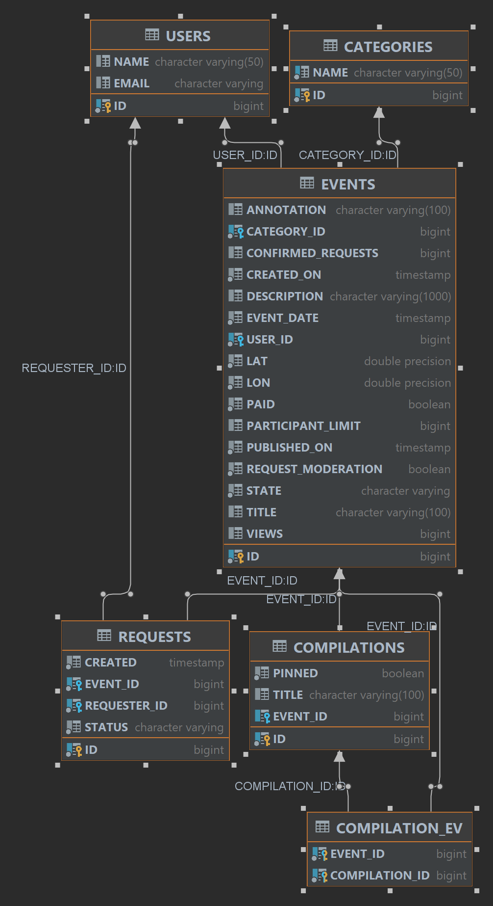

# java-explore-with-me

Template repository for ExploreWithMe project.

Приложение java-explore-with-me — это афиша.
В этой афише можно предложить какое-либо событие от выставки до похода в кино и собрать компанию для участия в нём.

Проект реализован микросервисной архитектурой.

    В приложении два сервиса:

1. В основном сервисе всё необходимое для работы продукта:
   API основного сервиса разделен на три части:

                                           ПУБЛИЧНАЯ

- доступна без регистрации любому пользователю сети;
- сортировка списка событий организована либо по количеству просмотров,
  которое будет запрашиваться в сервисе статистики, либо по датам событий;
- каждое событие относится к какой-то из закреплённых в приложении категорий;
- каждый публичный запрос для получения списка событий или полной информации о мероприятии
  фиксируется сервисом статистики.
-
                                       ЗАКРЫТАЯ 
- доступна только авторизованным пользователям;
- авторизованные пользователи имеют возможность добавлять в приложение новые мероприятия, редактировать их
  и просматривать после добавления;
- настроена подача заявок на участие в интересующих мероприятиях;
- создатель мероприятия имеет возможность подтверждать заявки, которые отправили другие пользователи сервиса.
-
                                       АДМИНИСТРАТИВНАЯ 
- для администраторов сервиса управление пользователями — добавление, активация, просмотр и удаление;
- добавление, изменение и удаление категорий для событий;
- возможность добавлять, удалять и закреплять на главной странице подборки мероприятий;
- модерация событий, размещённых пользователями, — публикация или отклонение;

2. Сервис статистики хранит количество просмотров и позволяет делать различные выборки для анализа работы приложения.

Схема базы данных приложения:

